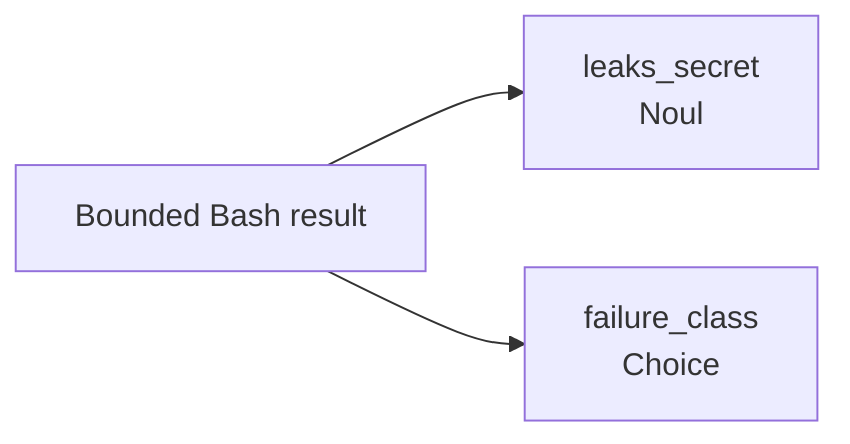
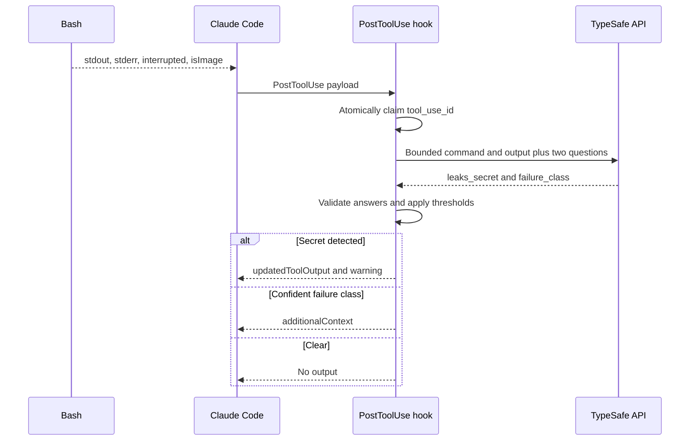
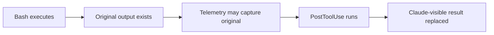
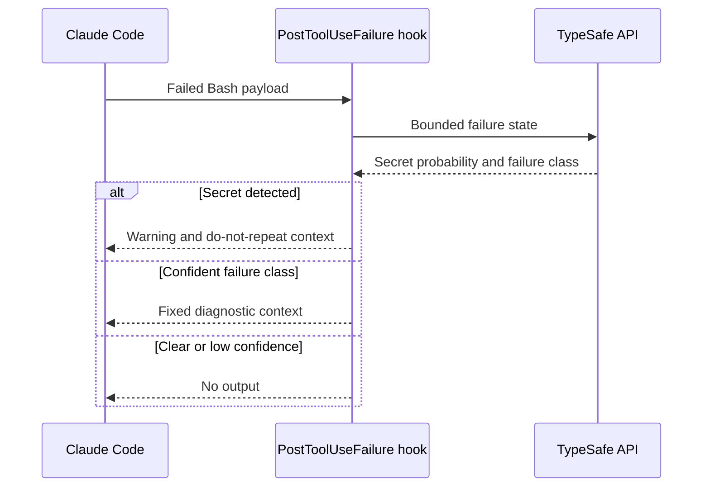

# Output judgments

Plugin judges successful and failed Bash output after execution. It can replace successful output before Claude sees it, but cannot undo command effects or replace failed output.

## Shared output questions



**ASCII version**

```text
                 [Bounded Bash result]
                          |
                +---------+---------+
                |                   |
                v                   v
      [leaks_secret / Noul] [failure_class / Choice]
```


`leaks_secret` uses threshold `0.90`. `failure_class` produces advice only at confidence `0.60` or above.

Choice categories:

| Class | Local advice |
| --- | --- |
| `transient` | Retrying unchanged may be reasonable |
| `environment` | Fix environment before retrying |
| `code_bug` | Fix code or types |
| `permission` | Change access or ask user |
| `user_error` | Fix command invocation or input |
| `no_failure` | No advice |

TypeSafe selects class; plugin supplies fixed advice text.

## Successful Bash output

Claude emits `PostToolUse` with structured Bash response.



**ASCII version**

```text
Bash            Claude Code        PostToolUse hook          TypeSafe
 |                       |                    |                      |
 |-- stdout/stderr ----->|                    |                      |
 |                       |-- result payload ->|                      |
 |                       |                    |-- claim tool ID      |
 |                       |                    |-- bounded result --->|
 |                       |                    |<-- typed answers ----|
 |                       |                    |-- validate + compose |
 |                       |<-- leak: replace --|                      |
 |                       |<-- advice: context-|                      |
 |                       |<-- clear: silence -|                      |
```


State sent to TypeSafe:

```json
{
  "cwd": "/project",
  "tool": "Bash",
  "is_error": false,
  "tool_input": {"command": "npm test"},
  "output": "first 2000 characters…[N chars elided]"
}
```

When secret threshold is crossed, recognized Bash output is replaced wholesale:

```json
{
  "hookSpecificOutput": {
    "hookEventName": "PostToolUse",
    "additionalContext": "claude-jev: Bash output may contain a secret; do not reproduce the value.",
    "updatedToolOutput": {
      "stdout": "[claude-jev] Output withheld because Jev flagged it as containing a secret. Do not reproduce the value.",
      "stderr": "",
      "interrupted": false,
      "isImage": false
    }
  },
  "systemMessage": "claude-jev: Bash output may contain a secret; output was withheld from Claude."
}
```



**ASCII version**

```text
[Bash executes]
       |
       v
[Original output exists]
       |
       v
[Telemetry may capture original]
       |
       v
[PostToolUse hook runs]
       |
       v
[Claude-visible output replaced]
```


Replacement cannot undo network transfers, file writes, process effects, or earlier telemetry. Secret detection also requires sending bounded potentially-sensitive output to TypeSafe.

## Failed Bash output

`PostToolUseFailure` carries error at top level:

```json
{
  "hook_event_name": "PostToolUseFailure",
  "tool_name": "Bash",
  "tool_input": {"command": "npm test"},
  "tool_use_id": "toolu_123",
  "error": "Exit code 1\nError: Cannot find module 'express'",
  "is_interrupt": false
}
```

Plugin normalizes it as output state with `is_error: true` and asks same two questions.



**ASCII version**

```text
Claude Code        PostToolUseFailure hook        TypeSafe
     |                            |                       |
     |-- failed Bash payload --->|                       |
     |                            |-- bounded failure --->|
     |                            |<-- typed answers -----|
     |                            |                       |
     |<-- secret: warning --------|                       |
     |<-- class: fixed context ---|                       |
     |<-- clear: no output -------|                       |
```


Failure hook may return `additionalContext`:

```json
{
  "hookSpecificOutput": {
    "hookEventName": "PostToolUseFailure",
    "additionalContext": "claude-jev: this Bash result reads as an environment failure; Fix the environment before retrying."
  }
}
```

Claude Code does not support `updatedToolOutput` for this event. Failed output cannot be replaced retroactively.

## Related guides

- [Integration overview](type-safe-integration.md)
- [Pre-tool judgments](pre-tool-judgments.md)
- [Reliability and privacy](reliability-and-privacy.md)
