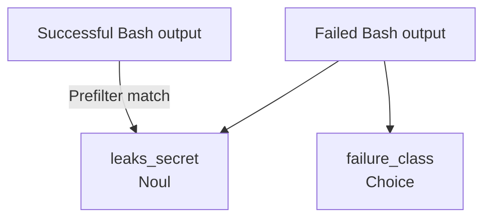
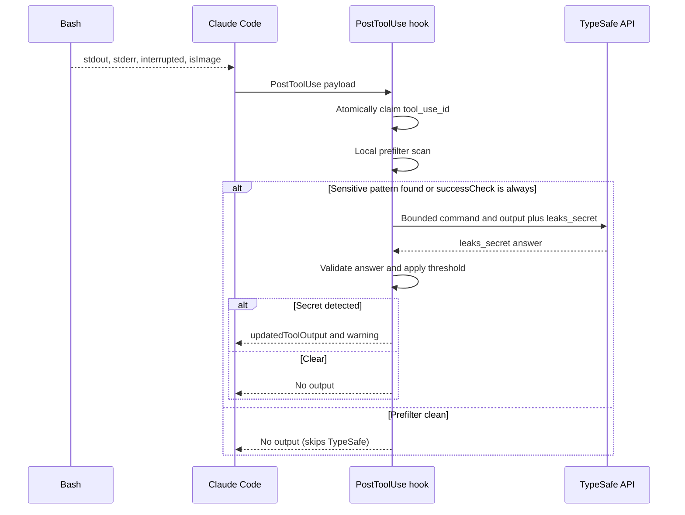
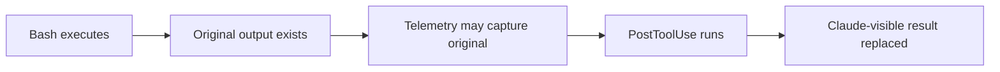
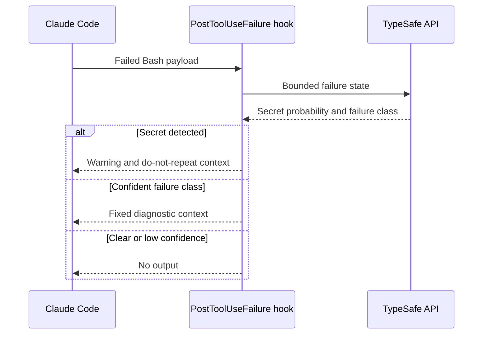

# Output judgments

Plugin judges successful and failed Bash output after execution. It can replace successful output before Claude sees it, but cannot undo command effects or replace failed output.

## Output questions



**ASCII version**

```text
[Successful Bash output]              [Failed Bash output]
           |                                   |
           | (prefilter match)                 | (always)
           v                                   v
 [leaks_secret / Noul]               +---------+---------+
                                     |                   |
                                     v                   v
                           [leaks_secret / Noul] [failure_class / Choice]
```


Successful Bash output is asked only the `leaks_secret` question. Failed commands (`PostToolUseFailure` or `is_error`) are asked both `leaks_secret` and `failure_class`. Classifying successful output produced false advice, for example `code_bug` for a command that printed an expected error message and exited 0. Successful commands never receive failure advice.

`leaks_secret` uses threshold `0.90`. `failure_class` produces advice only at confidence `0.60` or above.

Choice categories:

| Class | Local advice |
| --- | --- |
| `transient` | Retrying unchanged may be reasonable |
| `environment` | Fix environment before retrying |
| `code_bug` | Fix code or types |
| `permission` | Change access or ask user |
| `user_error` | Fix command invocation or input |
| `no_failure` | No advice |

TypeSafe selects class; plugin supplies fixed advice text.

## Successful Bash output

Claude emits `PostToolUse` with structured Bash response.



**ASCII version**

```text
Bash            Claude Code        PostToolUse hook          TypeSafe
 |                       |                    |                      |
 |-- stdout/stderr ----->|                    |                      |
 |                       |-- result payload ->|                      |
 |                       |                    |-- claim tool ID      |
 |                       |                    |-- prefilter scan     |
 |                       |                    |                      |
 |                       |                    |-- (match / always) ->|
 |                       |                    |   bounded result     |
 |                       |                    |<-- leaks_secret -----|
 |                       |                    |-- validate threshold |
 |                       |<-- leak: replace --|                      |
 |                       |<-- clear: silence -|                      |
 |                       |                    |                      |
 |                       |                    |-- (clean prefilter)  |
 |                       |<-- skip: silence --|   no network call    |
```


When `output.successCheck` is `"prefilter"` (default), the hook scans output and command locally before calling the network. Output with no sensitive patterns or secret-reading commands skips TypeSafe.

When the prefilter matches or `output.successCheck` is `"always"`, the hook queries TypeSafe with only the `leaks_secret` question. Successful output is never evaluated for failure classes.


State sent to TypeSafe:

```json
{
  "cwd": "/project",
  "tool": "Bash",
  "is_error": false,
  "tool_input": {"command": "npm test"},
  "output": "first 2000 characters…[N chars elided]"
}
```

When secret threshold is crossed, recognized Bash output is replaced wholesale:

```json
{
  "hookSpecificOutput": {
    "hookEventName": "PostToolUse",
    "additionalContext": "claude-jev: Bash output may contain a secret; do not reproduce the value.",
    "updatedToolOutput": {
      "stdout": "[claude-jev] Output withheld because Jev flagged it as containing a secret. Do not reproduce the value.",
      "stderr": "",
      "interrupted": false,
      "isImage": false
    }
  },
  "systemMessage": "claude-jev: Bash output may contain a secret; output was withheld from Claude."
}
```



**ASCII version**

```text
[Bash executes]
       |
       v
[Original output exists]
       |
       v
[Telemetry may capture original]
       |
       v
[PostToolUse hook runs]
       |
       v
[Claude-visible output replaced]
```


Replacement cannot undo network transfers, file writes, process effects, or earlier telemetry. Secret detection also requires sending bounded potentially-sensitive output to TypeSafe.

## Successful output prefilter

Setting `output.successCheck` controls when successful output is evaluated:

- `"prefilter"` (default): successful output goes to TypeSafe only when a local offline scan finds credential-like text or a secret-reading command. Everything else skips the network call. A hook that calls TypeSafe takes about 470 ms p50 end to end, so skipping clean output avoids this delay. Hook startup without a network call is about 42 ms p50.
- `"always"`: every successful output goes to TypeSafe, restoring previous behavior.

The local scan inspects up to the first 1,000,000 characters of output. It flags output for TypeSafe evaluation when it finds:

- Private key blocks (such as PEM or OpenSSH private keys).
- Known token formats: AWS, GitHub, GitLab, Slack, OpenAI and Anthropic-style `sk-` keys, Stripe, Google API keys, npm, SendGrid, Hugging Face, and JWTs.
- URLs with embedded credentials.
- Secret-looking assignments such as `API_KEY=...`, password fields, or credential tokens.
- Authorization headers.
- Mixed-case alphanumeric tokens of 32 or more characters. Lowercase hex values like git SHAs and checksums do not match.

The scan also flags commands that read secrets:

- Commands reading environment variables, such as `env`, `printenv`, `export -p`, or `set`.
- Commands reading credential or secret files, such as `cat .env`, `.npmrc`, `.netrc`, `.pgpass`, `credentials`, or secret configuration files.
- Commands reading private key files, such as `id_rsa`, `id_ed25519`, `.pem`, or `.key`.
- Token retrieval commands, such as `gh auth token`.
- Cloud CLI token commands for AWS, Google Cloud (`gcloud auth print-access-token`), and Azure (`az account get-access-token`).
- Kubernetes secret commands, such as `kubectl get secret`.
- Password managers, such as 1Password CLI (`op`), HashiCorp Vault (`vault`), Doppler (`doppler`), or macOS keychain (`security find-generic-password`).

Trade-off:
A secret in an unknown format printed by an ordinary command is not checked in prefilter mode. Set `output.successCheck: "always"` to restore checking every successful output.

Failed output bypasses the prefilter and is always sent to TypeSafe.

## Failed Bash output

`PostToolUseFailure` carries error at top level:

```json
{
  "hook_event_name": "PostToolUseFailure",
  "tool_name": "Bash",
  "tool_input": {"command": "npm test"},
  "tool_use_id": "toolu_123",
  "error": "Exit code 1\nError: Cannot find module 'express'",
  "is_interrupt": false
}
```

Plugin normalizes it as output state with `is_error: true`. Failed output is always sent to TypeSafe, skipping the prefilter, and is asked both `leaks_secret` and `failure_class`.



**ASCII version**

```text
Claude Code        PostToolUseFailure hook        TypeSafe
     |                            |                       |
     |-- failed Bash payload --->|                       |
     |                            |-- bounded failure --->|
     |                            |<-- typed answers -----|
     |                            |                       |
     |<-- secret: warning --------|                       |
     |<-- class: fixed context ---|                       |
     |<-- clear: no output -------|                       |
```


Failure hook may return `additionalContext`:

```json
{
  "hookSpecificOutput": {
    "hookEventName": "PostToolUseFailure",
    "additionalContext": "claude-jev: this Bash result reads as an environment failure; Fix the environment before retrying."
  }
}
```

Claude Code does not support `updatedToolOutput` for this event. Failed output cannot be replaced retroactively.

## Related guides

- [Integration overview](type-safe-integration.md)
- [Pre-tool judgments](pre-tool-judgments.md)
- [Reliability and privacy](reliability-and-privacy.md)
