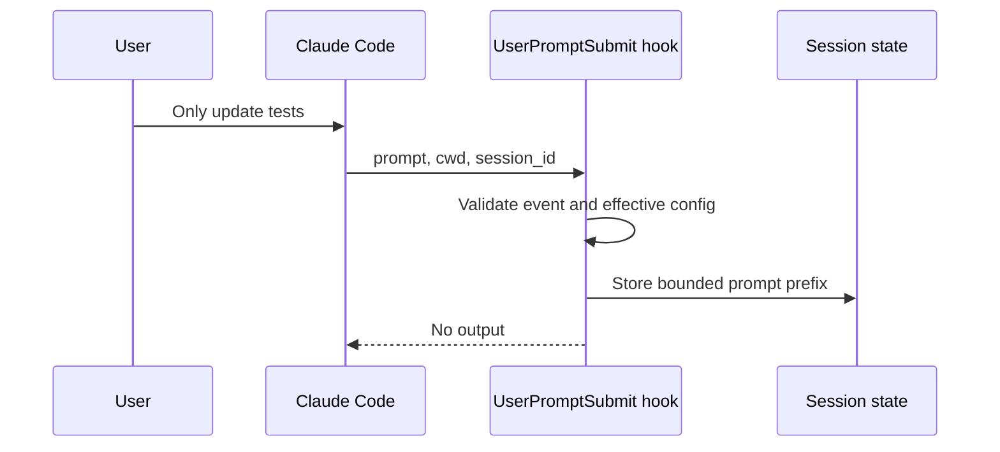
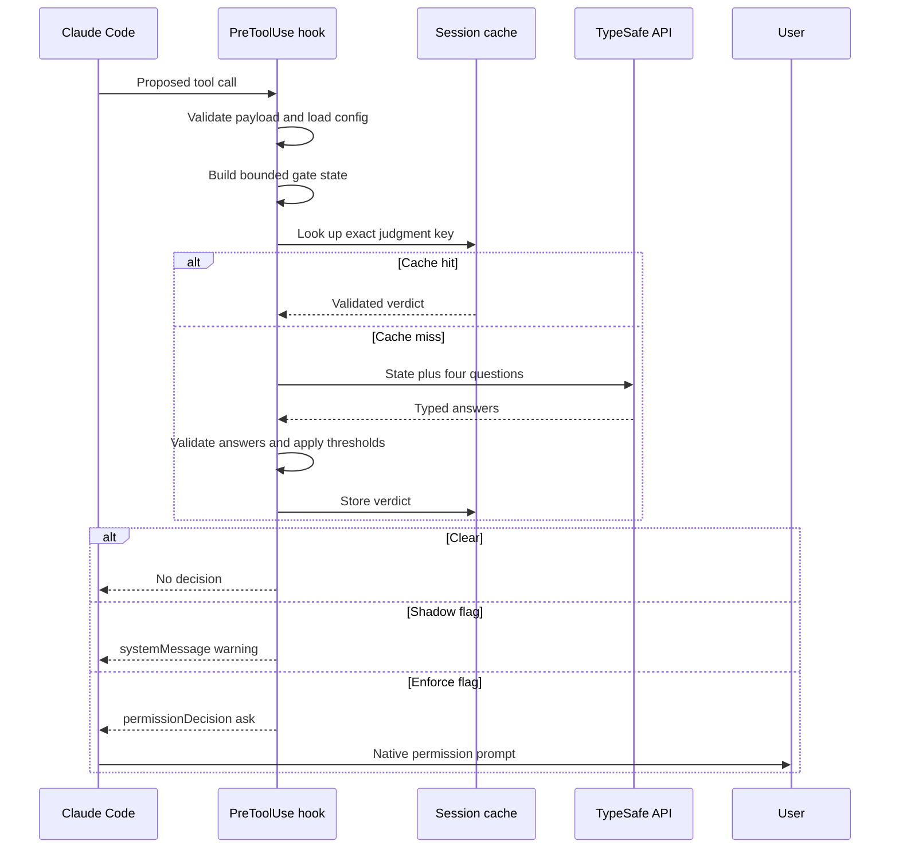
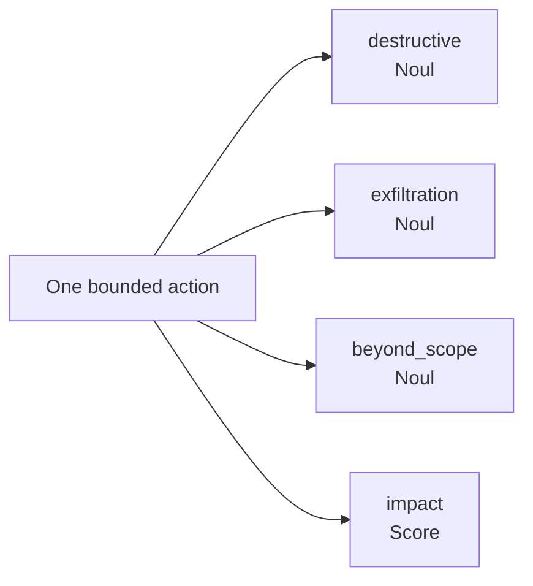
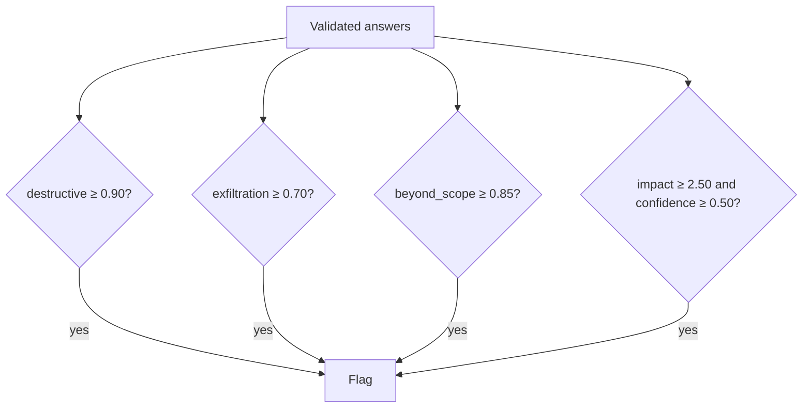

# Pre-tool judgments

Claude Code invokes `PreToolUse` before configured Bash, Write, and Edit calls. Plugin asks TypeSafe about semantic risk, validates answers, and applies local thresholds.

## Capturing current user intent

`PreToolUse` does not include current prompt. `UserPromptSubmit` stores first 1,200 Unicode code points when gate is enabled, session is not disabled, and TypeSafe key exists.



**ASCII version**

```text
User                  Claude Code        UserPromptSubmit       Session state
 |                            |                    |                      |
 |-- "Only update tests" --->|                    |                      |
 |                            |---- prompt ------->|                      |
 |                            |                    |-- validate config -->|
 |                            |                    |-- store 1,200 chars->|
 |                            |<--- no output -----|                      |
```


Plugin never reads full transcript for this purpose.

## Judgment sequence



**ASCII version**

```text
Claude Code        PreToolUse hook        Session cache       TypeSafe       User
     |                       |                       |                 |             |
     |-- proposed call ----->|                       |                 |             |
     |                       |-- validate + bound -->|                 |             |
     |                       |-- lookup exact key ->|                 |             |
     |                       |<----- hit ------------|                 |             |
     |                       |                                         |             |
     |                       |-- on miss: state + 4 questions -------->|             |
     |                       |<------------- typed answers ------------|             |
     |                       |-- validate + thresholds                 |             |
     |                       |-- cache verdict ----->|                 |             |
     |                       |                                         |             |
     |<-- clear: no output --|                                         |             |
     |<-- shadow: warning ---|                                         |             |
     |<-- enforce: ask ------|------------------------------------------------------>|
     |<------------------------------------------------ user decision ---------------|
```


## State sent to TypeSafe

Example Write call:

```json
{
  "cwd": "/project",
  "tool": "Write",
  "tool_input": {
    "file_path": "/project/src/auth.ts",
    "content": "first 400 characters…[N chars elided]"
  },
  "user_request": "Only update authentication tests"
}
```

Default limits:

| Value | Limit |
| --- | ---: |
| Each tool-input string | 400 characters |
| Current user request | 1,200 characters |
| Complete serialized state | 8,000 characters |

State excludes session ID, agent ID, transcript path, permission mode, API key, and unrelated conversation.

## Four questions



**ASCII version**

```text
                         [One bounded action]
                                  |
          +----------------+------+-------+----------------+
          |                |              |                |
          v                v              v                v
[destructive/Noul] [exfiltration/Noul] [beyond_scope/Noul] [impact/Score]
```


| ID | Meaning | Default threshold |
| --- | --- | ---: |
| `destructive` | Deletes, overwrites, or rewrites shared history | `0.90` |
| `exfiltration` | Sends local data or secrets outside project tooling | `0.70` |
| `beyond_scope` | Affects anything outside user request | `0.85` |
| `impact` | Damage if action was unwanted | `2.50`, confidence at least `0.50` |

Any crossed threshold flags action.



**ASCII version**

```text
[Validated TypeSafe answers]
              |
  +-----------+------------+-------------+
  |           |            |             |
  v           v            v             v
destructive exfiltration beyond_scope   impact
 >= 0.90?    >= 0.70?      >= 0.85?     >= 2.50 and confidence >= 0.50?
  |           |            |             |
  +----- yes--+----- yes ---+----- yes ---+
              |
              v
          [Flag action]
```


## Shadow mode

Default shadow mode returns warning and does not approve or deny:

```json
{
  "systemMessage": "claude-jev shadow: Bash flagged (destructive 0.96, impact 2.80/3)"
}
```

## Enforce mode

Interactive case returns native ask decision:

```json
{
  "hookSpecificOutput": {
    "hookEventName": "PreToolUse",
    "permissionDecision": "ask",
    "permissionDecisionReason": "claude-jev flagged Bash: destructive 0.96, impact 2.80/3"
  }
}
```

Plugin never returns `allow` from TypeSafe confidence.

Claude hook payload has no universal prompt-host field. Plugin recognizes documented non-interactive `permission_mode` values `dontAsk` and `bypassPermissions`:

- `blockWithoutUI: false`: no decision, fail open;
- `blockWithoutUI: true`: return `deny`.

Other modes return `ask`; Claude Code owns prompt-host behavior.

## Related guides

- [Integration overview](type-safe-integration.md)
- [Output judgments](output-judgments.md)
- [Reliability and privacy](reliability-and-privacy.md)
