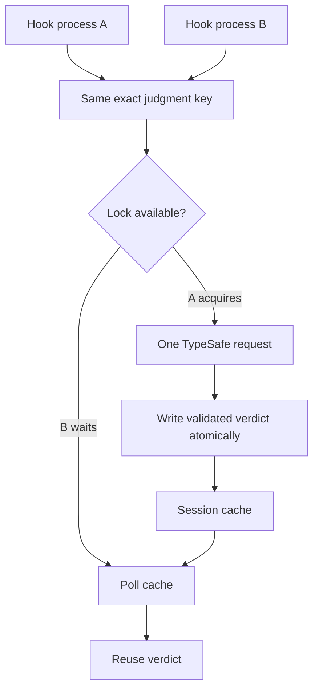
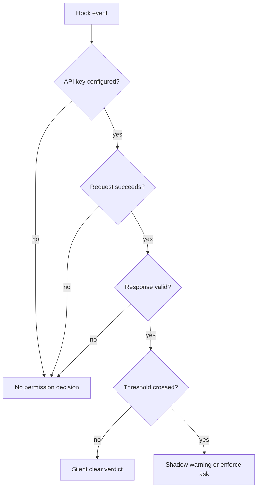
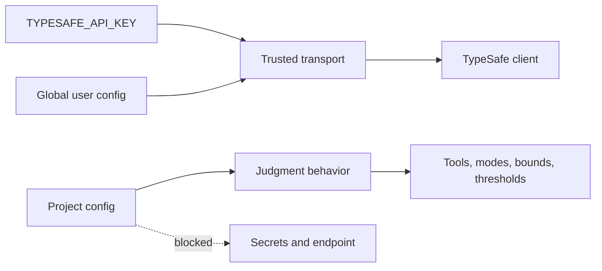
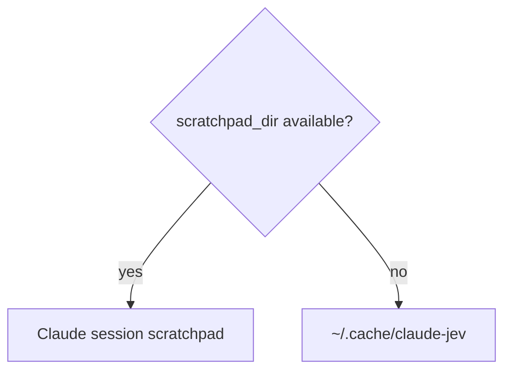

# Reliability, privacy, and trust boundaries

Plugin coordinates short-lived hook processes, bounds all external state, and deliberately fails open when no validated judgment is available.

## Cache and duplicate suppression



**ASCII version**

```text
Hook process A ----+
                   +--> [Exact judgment key] --> [Lock available?]
Hook process B ----+                              |           |
                                                  | yes       | no
                                                  v           v
                                      [One TypeSafe call] [Wait + poll cache]
                                                  |
                                                  v
                                      [Atomic verdict write]
                                                  |
                                                  +---------> [Reuse verdict]
```


Cache key includes exact bounded state, current directory, model, question definitions, thresholds, and payload bounds. Cache directory includes hash of session ID and optional agent ID, isolating subagents.

Gate cache TTL defaults to 120 seconds. Output TTL is 120 seconds.

Lock owner writes random token and renews heartbeat. Waiters do not remove live lock as stale. Coordination timeout returns no verdict instead of starting duplicate request. Tool-use IDs are atomically claimed so overlapping success and failure events cannot both be judged.

## Deadlines and retries

```mermaid
gantt
    title One TypeSafe request budget
    dateFormat X
    axisFormat %L ms
    Initial request       :a, 0, 5000
    Retry delay           :b, after a, 1000
    Retry attempt         :c, after b, 7000
    Safety margin         :d, after c, 2000
```



**ASCII version**

```text
0 ms                                                           15,000 ms
|-----------------------------------------------------------------------|
| Initial request | retry delay | retry attempt | safety margin          |
|-----------------------------------------------------------------------|

The 15-second budget covers every request attempt, body read, parse,
and retry delay. Claude's hook timeout is 20 seconds.
```


| Layer | Limit |
| --- | ---: |
| TypeSafe total deadline | 15 seconds |
| Claude judgment hook timeout | 20 seconds |
| Cache coordination wait | 16 seconds |
| Cache stale threshold | 30 seconds |

Deadline includes connection, response body, JSON parsing, retry delays, and all attempts. It is not 15 seconds per attempt.

Retryable conditions are network failure, timeout with remaining budget, HTTP 429, HTTP 529, and HTTP 5xx. Backoff is exponential, bounded, and jittered. `Retry-After` is honored only when it fits remaining budget.

## Fail-open behavior



**ASCII version**

```text
[Hook event]
     |
     v
[API key?] -- no -------------------------------> [No decision / fail open]
     |
    yes
     v
[Request succeeds?] -- no ----------------------> [No decision / fail open]
     |
    yes
     v
[Response valid?] -- no ------------------------> [No decision / fail open]
     |
    yes
     v
[Threshold crossed?] -- no ---------------------> [Silent clear verdict]
     |
    yes
     v
[Shadow warning or enforce ask]
```


No judgment is returned for missing key, malformed config, invalid endpoint, timeout, network failure, retry exhaustion, malformed TypeSafe response, cache timeout, state failure, or Claude hook timeout.

Infrastructure failure is never cached as clear. Diagnostics use fixed local text and exclude malformed input, parser errors, API bodies, prompts, command output, and credentials.

## Configuration trust boundary



**ASCII version**

```text
[TYPESAFE_API_KEY] ----+
                           +--> [Trusted transport] --> [TypeSafe client]
[Global user config] ------+

[Project config] ------------> [Judgment behavior]
                                  |
                                  v
                         tools / modes / bounds /
                         cache / thresholds

[Project config] -X-> API key / key file / endpoint / retries
```


Global `~/.claude/claude-jev.json` may set model, HTTPS endpoint, total timeout, retries, and API-key file. Environment key has highest secret precedence.

Project `.claude/claude-jev.json` may set gate/output enablement, mode, tools, bounds, cache duration, thresholds, and `blockWithoutUI`. It cannot set model, endpoint, timeout, retries, API key, or key file. This prevents repository-controlled credential and data redirection.

Remote endpoints must use HTTPS. Plain `http:` is allowed only for a local endpoint, meaning hostname `localhost`, `127.x.x.x`, or `[::1]`. No endpoint may contain embedded credentials.

A local endpoint needs no API key. The client sends no Authorization header without one and never sends `TYPESAFE_API_KEY` to a local endpoint. A key for a local server (`KEV_API_KEY` or `LAYA_API_KEY`) goes in the global `apiKeyFile`. Laya binds 0.0.0.0 by default; start it with LAYA_HOST=127.0.0.1 to keep it on loopback.

With a local model such as Kev (https://github.com/jaredpalmer/kev) or Laya (https://github.com/NandhaKishorM/laya), state and questions stay on the machine and TypeSafe does not bill them. Hooks and `claude-jev ask` still send the same data to that local process. `claude-jev status` shows `Endpoint: local` or `Endpoint: remote`.

## External data

TypeSafe may receive bounded:

- current working directory;
- tool name and tool input;
- source or diff fragments from Write/Edit;
- first 1,200 characters of current user request;
- Bash command and first 2,000 output characters.

Plugin does not send full transcript, session ID, agent ID, transcript path, permission mode, API key as state, or raw cache records.

Secret detection has an unavoidable privacy tradeoff: bounded output may already contain the secret TypeSafe is asked to identify.

## Decision helper data

`claude-jev ask` sends the whole `state` object and every question, including instructions and criteria, to TypeSafe in one request. Nothing is elided. The caller controls the content, so treat all of it as leaving the machine. TypeSafe bills each request. Retries resend the full body, for up to 1 plus `retries` attempts within `timeoutMs`.

The `/claude-jev:decide` skill runs only when the user invokes it. It shows the user a summary of what will be sent and requires confirmation before every request, with sensitive details flagged. It excludes conversation history and secrets from state. TypeSafe output is evidence, not consent or authorization.

Input limits apply before any request:

- 64 KiB of UTF-8 input;
- serialized state up to `maxStateChars` (default 8000);
- 1 to 32 questions with valid names;
- instructions up to 2000 characters, criteria up to 500 characters;
- Score 2 to 10 criteria, Choice 2 to 20 criteria.

Invalid input exits with code 2 and sends nothing. TypeSafe or configuration errors exit with code 1. Error output has only a fixed category, code, HTTP status, and model. It never includes response bodies, state, or question text.

The client makes no model fallback. The model-family check applies only to remote endpoints. A local server is run by the user and may report its own checkpoint name (Laya answers `english` requests as `laya-rl-agent`), so local responses are not rejected for a model mismatch. Remote endpoints fail with `MODEL_MISMATCH` on a cross-family answer.

## Local state



**ASCII version**

```text
[scratchpad_dir available?]
          | yes
          +--------------------> [Claude session scratchpad]
          |
         no
          v
[~/.cache/claude-jev]
```


State contains bounded prompt, session overrides, latest verdict summaries, seen tool IDs, and diagnostic timestamps. Session filenames hash session and optional agent identities. Files use restrictive permissions and locked atomic updates.

With a scratchpad, state is `<scratchpad>/<hash>.json` and caches are `<scratchpad>/cache/<hash>`. Otherwise state is in `~/.cache/claude-jev`. Session state never uses `CLAUDE_PLUGIN_DATA`: Claude Code sets it for hooks but not for the Bash tool, so `claude-jev status`, `last`, `enable`, `disable`, and `mode` would read a different directory than the hooks. Judgment caches are hook-only, so they use `$CLAUDE_PLUGIN_DATA/cache` when it is set and `~/.cache/claude-jev/cache` otherwise.

Earlier versions kept caches in `~/.cache/claude-jev/cache` even when plugin data existed, and versions before 0.2.1 kept session state in `$CLAUDE_PLUGIN_DATA/sessions`. The retention sweep also prunes both legacy locations, so they age out after `retentionDays`.

Scratchpad lifetime is managed by Claude Code. Plugin data persists through updates and is removed by uninstall unless `--keep-data` is used. Retention. Session state files and per-session cache directories older than `retentionDays` (default 7, global configuration only, `0` disables) are deleted by `UserPromptSubmit`, at most once per day. A marker file `.last-prune` in the first existing state directory throttles the sweep. The sweep skips the current session, deletes at most 500 items per run, never follows symlinks, and touches only files named by the plugin's hash patterns. It fails open.

## Related guides

- [Integration overview](type-safe-integration.md)
- [Pre-tool judgments](pre-tool-judgments.md)
- [Output judgments](output-judgments.md)
- [End-to-end example](end-to-end-example.md)
