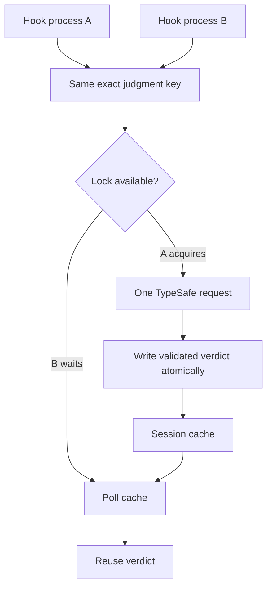
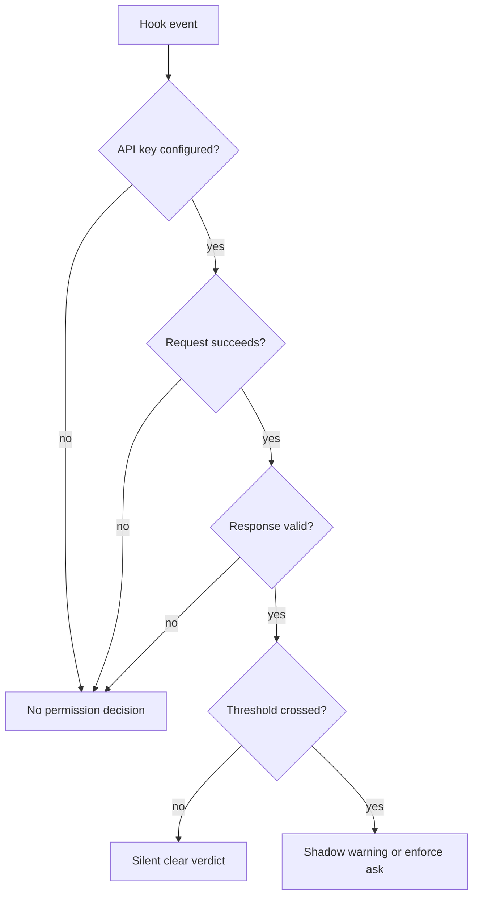
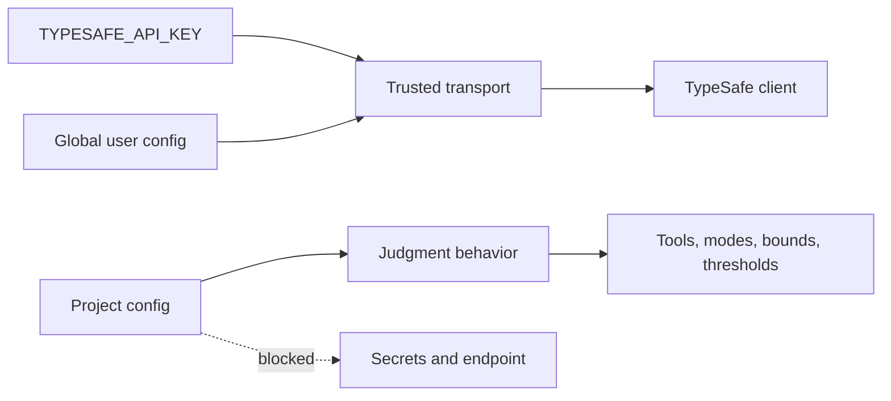
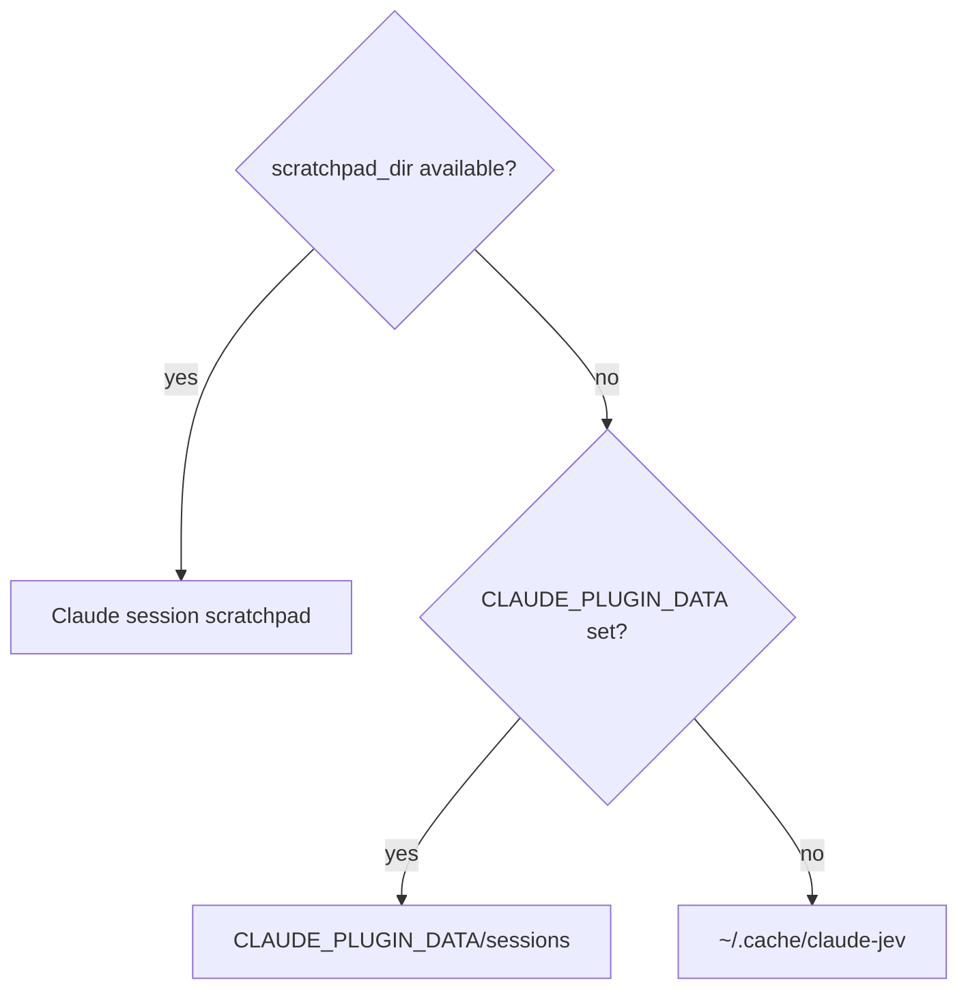

# Reliability, privacy, and trust boundaries

Plugin coordinates short-lived hook processes, bounds all external state, and deliberately fails open when no validated judgment is available.

## Cache and duplicate suppression



**ASCII version**

```text
Hook process A ----+
                   +--> [Exact judgment key] --> [Lock available?]
Hook process B ----+                              |           |
                                                  | yes       | no
                                                  v           v
                                      [One TypeSafe call] [Wait + poll cache]
                                                  |
                                                  v
                                      [Atomic verdict write]
                                                  |
                                                  +---------> [Reuse verdict]
```


Cache key includes exact bounded state, current directory, model, question definitions, thresholds, and payload bounds. Cache directory includes hash of session ID and optional agent ID, isolating subagents.

Gate cache TTL defaults to 120 seconds. Output TTL is 120 seconds.

Lock owner writes random token and renews heartbeat. Waiters do not remove live lock as stale. Coordination timeout returns no verdict instead of starting duplicate request. Tool-use IDs are atomically claimed so overlapping success and failure events cannot both be judged.

## Deadlines and retries

```mermaid
gantt
    title One TypeSafe request budget
    dateFormat X
    axisFormat %L ms
    Initial request       :a, 0, 5000
    Retry delay           :b, after a, 1000
    Retry attempt         :c, after b, 7000
    Safety margin         :d, after c, 2000
```



**ASCII version**

```text
0 ms                                                           15,000 ms
|-----------------------------------------------------------------------|
| Initial request | retry delay | retry attempt | safety margin          |
|-----------------------------------------------------------------------|

The 15-second budget covers every request attempt, body read, parse,
and retry delay. Claude's hook timeout is 20 seconds.
```


| Layer | Limit |
| --- | ---: |
| TypeSafe total deadline | 15 seconds |
| Claude judgment hook timeout | 20 seconds |
| Cache coordination wait | 16 seconds |
| Cache stale threshold | 30 seconds |

Deadline includes connection, response body, JSON parsing, retry delays, and all attempts. It is not 15 seconds per attempt.

Retryable conditions are network failure, timeout with remaining budget, HTTP 429, HTTP 529, and HTTP 5xx. Backoff is exponential, bounded, and jittered. `Retry-After` is honored only when it fits remaining budget.

## Fail-open behavior



**ASCII version**

```text
[Hook event]
     |
     v
[API key?] -- no -------------------------------> [No decision / fail open]
     |
    yes
     v
[Request succeeds?] -- no ----------------------> [No decision / fail open]
     |
    yes
     v
[Response valid?] -- no ------------------------> [No decision / fail open]
     |
    yes
     v
[Threshold crossed?] -- no ---------------------> [Silent clear verdict]
     |
    yes
     v
[Shadow warning or enforce ask]
```


No judgment is returned for missing key, malformed config, invalid endpoint, timeout, network failure, retry exhaustion, malformed TypeSafe response, cache timeout, state failure, or Claude hook timeout.

Infrastructure failure is never cached as clear. Diagnostics use fixed local text and exclude malformed input, parser errors, API bodies, prompts, command output, and credentials.

## Configuration trust boundary



**ASCII version**

```text
[TYPESAFE_API_KEY] ----+
                           +--> [Trusted transport] --> [TypeSafe client]
[Global user config] ------+

[Project config] ------------> [Judgment behavior]
                                  |
                                  v
                         tools / modes / bounds /
                         cache / thresholds

[Project config] -X-> API key / key file / endpoint / retries
```


Global `~/.claude/claude-jev.json` may set model, HTTPS endpoint, total timeout, retries, and API-key file. Environment key has highest secret precedence.

Project `.claude/claude-jev.json` may set gate/output enablement, mode, tools, bounds, cache duration, thresholds, and `blockWithoutUI`. It cannot set model, endpoint, timeout, retries, API key, or key file. This prevents repository-controlled credential and data redirection.

The global `model` setting defaults to `jev-latest`. The client forwards a non-empty configured ID unchanged. An unavailable or incompatible selection returns no validated judgment; the client does not retry with Jev. Check alternate IDs in TypeSafe's [model docs](https://docs.typesafe.ai/models) or `GET /v1/models`, then confirm the [System One response contract](https://docs.typesafe.ai/api).

Endpoints must use HTTPS and cannot contain embedded credentials.

## External data

TypeSafe may receive bounded:

- current working directory;
- tool name and tool input;
- source or diff fragments from Write/Edit;
- first 1,200 characters of current user request;
- Bash command and first 2,000 output characters.

Plugin does not send full transcript, session ID, agent ID, transcript path, permission mode, API key as state, or raw cache records.

Secret detection has an unavoidable privacy tradeoff: bounded output may already contain the secret TypeSafe is asked to identify.

## Custom decision requests

`claude-jev ask` sends only its `state` and `questions` fields to the configured TypeSafe endpoint. It does not send conversation history. The complete JSON input is limited to 64 KiB, state is limited by `maxStateChars` (8,000 by default), and each request can contain up to 32 questions. TypeSafe API usage may incur cost.

The `/claude-jev:decide` skill asks before sending sensitive details. TypeSafe results remain advisory. An unavailable model or invalid response does not count as a clear result, and the command does not switch models automatically. The skill reports that no TypeSafe judgment is available and continues with Claude's ordinary reasoning.

## Local state



**ASCII version**

```text
[scratchpad_dir available?]
          | yes
          +--------------------> [Claude session scratchpad]
          |
         no
          v
[CLAUDE_PLUGIN_DATA set?]
          | yes
          +--------------------> [CLAUDE_PLUGIN_DATA/sessions]
          |
         no
          v
[~/.cache/claude-jev]
```


State contains bounded prompt, session overrides, latest verdict summaries, seen tool IDs, and diagnostic timestamps. Session filenames hash session and optional agent identities. Files use restrictive permissions and locked atomic updates.

Scratchpad lifetime is managed by Claude Code. Plugin data persists through updates and is removed by uninstall unless `--keep-data` is used. Legacy fallback has no automatic retention sweep.

## Related guides

- [Integration overview](type-safe-integration.md)
- [Pre-tool judgments](pre-tool-judgments.md)
- [Output judgments](output-judgments.md)
- [End-to-end example](end-to-end-example.md)
