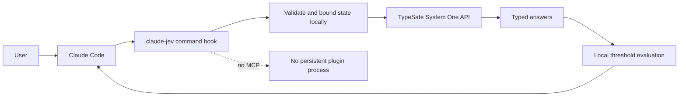
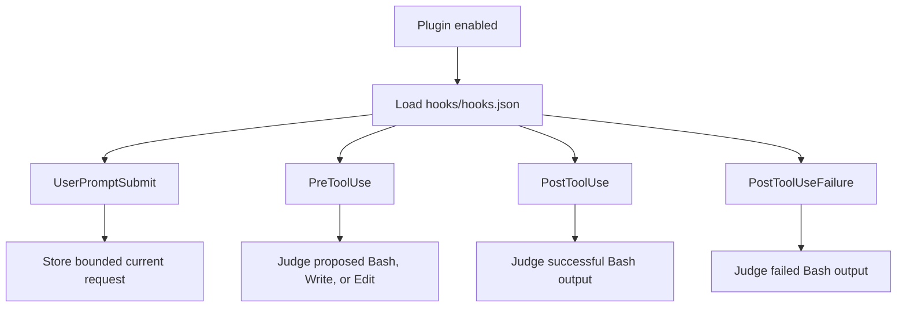

# TypeSafe AI integration overview

`claude-jev-plugin` inserts TypeSafe System One judgments into Claude Code's hook lifecycle. TypeSafe is an external semantic classifier. It does not replace Claude, grant permissions, or run an MCP server.

## Architecture



**ASCII version**

```text
[User]
   |
   v
[Claude Code] ---> [claude-jev command hook]
                          |
                          v
                [Validate + bound state]
                          |
                          v
                [TypeSafe System One]
                          |
                          v
                   [Typed answers]
                          |
                          v
                [Local threshold logic]
                          |
                          +--------> [Claude Code]

No MCP server. No persistent plugin process.
```


Claude starts a short-lived Node.js process for every matching hook event. Event JSON arrives on stdin. Hook writes either no output or one Claude-compatible JSON object to stdout.

Hook configuration uses exec form:

```json
{
  "type": "command",
  "command": "node",
  "args": ["${CLAUDE_PLUGIN_ROOT}/dist/hooks/pre-tool.js"],
  "timeout": 20
}
```

Tool input remains process data and is never interpolated into shell source.

## Activation

Plugin installs disabled by default because activation sends bounded data to an external service and may incur TypeSafe API cost.

```text
/plugin marketplace add dr-dimitru/claude-plugins-marketplace
/plugin install claude-jev@dr-dimitru-claude-tools --scope user
```

Set key outside project configuration:

```bash
export TYPESAFE_API_KEY="..."
```

Then enable and reload:

```text
/plugin enable claude-jev@dr-dimitru-claude-tools
/reload-plugins
```

Claude discovers four handlers:



**ASCII version**

```text
                         [Plugin enabled]
                                |
                                v
                     [Load hooks/hooks.json]
                                |
       +----------------+-------+-------+-------------------+
       |                |               |                   |
       v                v               v                   v
[UserPromptSubmit] [PreToolUse]   [PostToolUse]   [PostToolUseFailure]
       |                |               |                   |
       v                v               v                   v
[Store bounded    [Judge Bash,    [Judge successful   [Judge failed
current request]   Write, Edit]     Bash output]        Bash output]
```


Automatic hooks do not require skill invocation.

## TypeSafe request

Plugin sends one HTTPS request for all independent questions about one state:

```http
POST https://api.typesafe.ai/v1/systemone
Authorization: Bearer $TYPESAFE_API_KEY
Content-Type: application/json
```

```json
{
  "model": "jev-latest",
  "state": {"tool": "Bash", "tool_input": {"command": "git status"}},
  "questions": {
    "destructive": {
      "type": "noul",
      "instructions": "Is this action destructive?"
    }
  }
}
```

Response must contain model, usage, and one typed answer per question. Plugin rejects missing answers, unknown options, incomplete distributions, invalid score legends, non-finite numbers, and probabilities that do not sum to one.

## Decision helper request

`claude-jev ask` uses the same endpoint for user-requested decisions. It reads `{ "state": ..., "questions": {...} }` from stdin and sends one request with all questions. It does not split questions into several requests.

The client sends the configured `model` (default `jev-latest`, an alias for `jev-1.13.0`). Only trusted global configuration sets the model or endpoint. There is no CLI override and no automatic fallback.

The same wire contract works against a local server. Kev (https://github.com/jaredpalmer/kev) and Laya (https://github.com/NandhaKishorM/laya) are open-weight models that serve `POST /v1/systemone` and are not served by TypeSafe. Example global configuration:

```json
{ "model": "kev-latest", "endpoint": "http://127.0.0.1:8009/v1/systemone" }
```

```json
{ "model": "english", "endpoint": "http://127.0.0.1:8000/v1/systemone" }
```

A local endpoint has hostname `localhost`, `127.x.x.x`, or `[::1]`. Only local endpoints may use plain `http:`. They need no API key, the client sends no Authorization header without one, and `TYPESAFE_API_KEY` is never sent to them. Laya answers omit `type` and add `answer_confidence`. The plugin takes the type from the declared question and drops `answer_confidence`. Kev adds `latency_ms`, which the plugin drops. Laya's README shows only the choice response shape, so noul and score responses are unverified. See the README [Model selection](../README.md#model-selection) section.

The client checks the model family of the response. Family is the text before the first `-`. `jev-latest` answered by `jev-1.13.0` passes. An answer from another family, such as `kev` for a `jev-latest` request, fails with `MODEL_MISMATCH`. An `org/` prefix is ignored, so `jaredpalmer/kev-4b` and `kev-latest` are both family `kev`. Laya names are their own families: `english`, `multilingual`, and `typed`.

Output is limited to `model`, validated answers, and `usage` token counts. The plugin drops other response fields. Probability maps must sum to one within `max(0.05, categories x 0.005)`, and the client renormalizes them. Limits are in the README [Decision helper](../README.md#decision-helper) section.

## Question primitives

### Noul

Noul answers a yes/no semantic question as probability from 0 to 1:

```json
{"type": "noul", "noul": 0.96}
```

Noul has no separate confidence value. Plugin uses it for destructive action, exfiltration, scope, and secret detection.

### Choice

Choice selects one declared category and returns full distribution:

```json
{
  "type": "choice",
  "choice": "environment",
  "probabilities": {
    "transient": 0.05,
    "environment": 0.80,
    "code_bug": 0.05,
    "permission": 0.05,
    "user_error": 0.03,
    "no_failure": 0.02
  },
  "confidence": 0.76
}
```

Plugin uses Choice to classify Bash failures.

### Score

Score rates state across ordered criteria:

```json
{
  "type": "score",
  "score": 2.8,
  "legend": {
    "0": "None, it only reads",
    "1": "Small, one file or one reversible change",
    "2": "Large, many files or shared state",
    "3": "Severe, data loss or a forced overwrite of shared history"
  },
  "probabilities": {"0": 0.0, "1": 0.0, "2": 0.2, "3": 0.8},
  "confidence": 0.84
}
```

TypeSafe supplies typed semantic evidence. Local plugin code decides whether configured thresholds were crossed.

## Related guides

- [Pre-tool judgments](pre-tool-judgments.md)
- [Output judgments](output-judgments.md)
- [Reliability and privacy](reliability-and-privacy.md)
- [End-to-end example](end-to-end-example.md)
